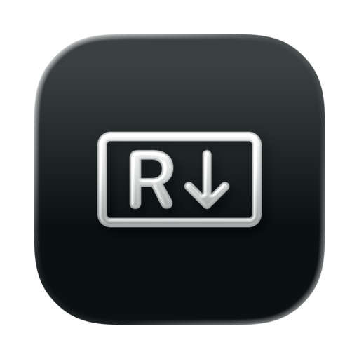

  

<h1 align="center">Readdown</h1>

A clean, fast Markdown reader for macOS. Just open .md files and read - no editing, no clutter.

  

## Features

- **Instant open** - Double-click any .md file. No project loading, no workspace setup.
- **GitHub-style rendering** - Headings, lists, tables, code blocks, task lists - rendered the way you expect.
- **Light and dark mode** - Follows your system appearance automatically.
- **Read-only by design** - Your files stay untouched. No accidental edits, no auto-formatting surprises.
- **Native macOS app** - Built with Swift and SwiftUI. Lightweight, fast, private - no telemetry.
- **Quick Look preview** - Press spacebar on any .md file in Finder to see it rendered instantly.
- **Set as default reader** - Replace Xcode, TextEdit, or VS Code as your .md handler in one click.

## Download

Get the latest release from [GitHub Releases](https://github.com/nataliarsand/readdown/releases) or visit the website at [heya.studio/readdown](https://heya.studio/readdown).

## Build from source

1. Clone the repo
2. Open `ReadDown.xcodeproj` in Xcode
3. Build and run (requires macOS 13+)

## Support

If you find Readdown useful, you can [buy me a coffee](https://www.paypal.com/donate/?hosted_button_id=EFG82PKZJU3RC).
