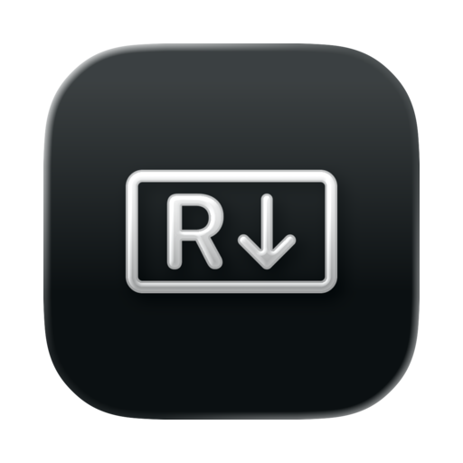
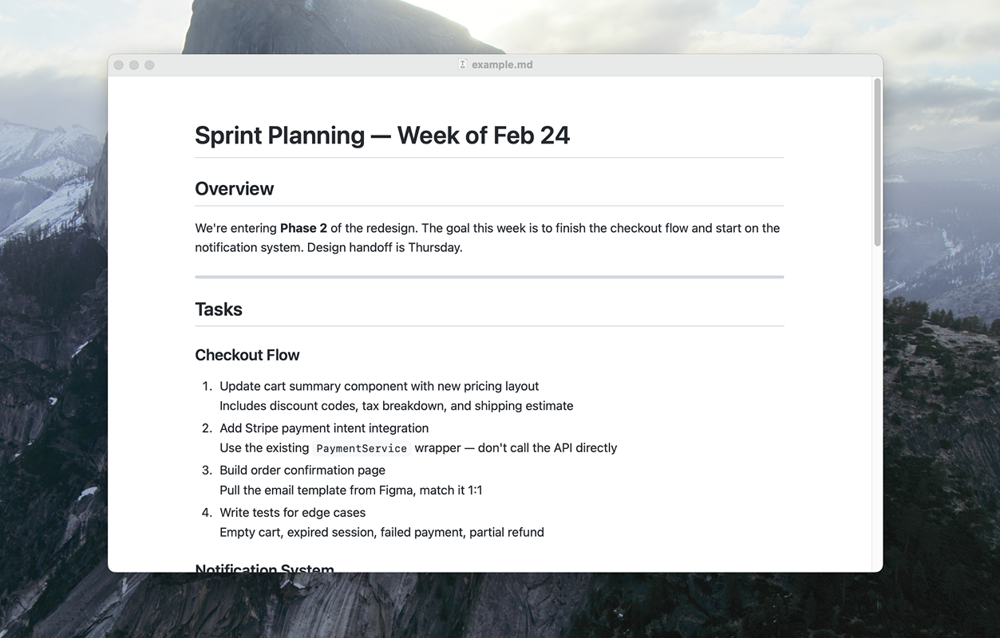

  

<h1 align="center">Readdown</h1>

  The Markdown reader macOS never shipped. 
  Double-click to read, spacebar to preview — nothing more.

  <a href="https://github.com/nataliarsand/readdown/releases/latest/download/Readdown.dmg">Download for Mac</a> · <a href="https://heya.studio/readdown/">Website</a>

  

## Features

- **Read-only** — No edits, no auto-formatting. Your files stay untouched.
- **Quick Look** — Spacebar on any .md in Finder. Rendered, not raw.
- **Lightweight** — Native Swift. Opens in under a second, stays out of your way.
- **GitHub-style** — Tables, code blocks, task lists — rendered the way you expect.
- **Dark mode** — Follows your system appearance automatically.
- **Default reader** — One click to replace Xcode or TextEdit as your .md handler.

## Quick Look Setup

On first launch, Readdown walks you through this — but here are the manual steps:

1. Open **System Settings → General → Login Items & Extensions**
2. Click **ℹ︎** next to **Quick Look**
3. Toggle **Readdown** on

## Download

Get the latest release from [GitHub Releases](https://github.com/nataliarsand/readdown/releases/latest/download/Readdown.dmg).

Requires macOS 13 Ventura or later.

## Build from source

1. Clone the repo
2. Open `ReadDown.xcodeproj` in Xcode
3. Build and run (requires macOS 13+)

## License

Source-available. You may view, study, and contribute, but redistribution is not permitted. See [LICENSE](LICENSE) for details.

## Support

If you find Readdown useful, you can [buy me a coffee](https://www.paypal.com/donate/?hosted_button_id=EFG82PKZJU3RC).
